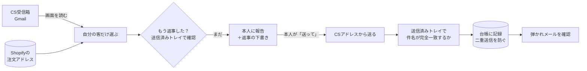

# claude-cs-mail-skill

**Claude（Claude Code）が、ネットショップのCS用メールを読んで・自分の客だけ拾って・返事して・ちゃんと届いたか確かめる** ためのスキルです。

公式のGmail連携では「自分個人のアドレス」しか見えません。共有のCS用アドレスは、**Claude専用のブラウザを遠隔操作して、人と同じGmailの画面から**扱います。

## しくみ



| 段階 | どうやってるか |
|---|---|
| どこから拾う | Claude専用ブラウザ（Chromium系・遠隔操作口つき）でCSのGmailを開き、一覧を読み取る |
| 誰の客か見分ける | Shopifyの注文に入ってるメールアドレスと照合／ブランド名が入ってるか |
| 返事済みか | 送信済みトレイで「その客のメールより後に出したか」 |
| 送る | Gmailの作成画面を開いて送信。ブラウザにCSアドレスだけでログインしてるので、必ずCSアドレスから出る |
| 確かめる | ①送信ボタン ②送信済みトレイに件名が完全一致する1通 ③台帳 ④弾かれメール |

## 入れ方

```bash
git clone https://github.com/<this-repo>.git
cp -R claude-cs-mail-skill/skills/cs-mail ~/.claude/skills/
pip3 install websocket-client
~/.claude/skills/cs-mail/scripts/seat.sh start   # 開いた窓でCSのGmailにログイン（初回だけ）
~/.claude/skills/cs-mail/scripts/csmail.py list  # 一覧が出ればOK
```

あとは Claude Code に「CSメール見て」「この客に返信して」と言うだけです。

## 中身

```
skills/cs-mail/
├── SKILL.md                  # Claudeが読む手順書（守ること10個つき）
├── scripts/
│   ├── seat.sh               # 専用ブラウザの起動・状態・停止
│   ├── csmail.py             # 読む・開く・送る（＋送信済みで確認）
│   ├── ikkatsu_mail.py       # 同じ文面を一斉に（台帳で二重防止）
│   ├── junbi_mail.py         # 注文からN日後の自動メール
│   └── namae_check.py        # 宛名の姓名の逆を直す
├── templates/junbi.md        # 「準備してます」メールの型
└── examples/mimawari_prompt.md  # 朝夕の見回り（客には送らない設定）
```

## ⚠️ 大事なこと

- **客に送る前に、人が文面を見て「送って」と言う** 運用にしてください。メールは取り消せません
- 返金・キャンセルは、人が「押して」と言った1件だけ
- Gmailの画面の作りが変わると読み取りが壊れます（画面の部品を読んでいるため）
- ファイル添付はできません。説明書などはページにしてリンクで送ってください
- パソコンがスリープ中は自動実行は動きません

## ライセンス

MIT
